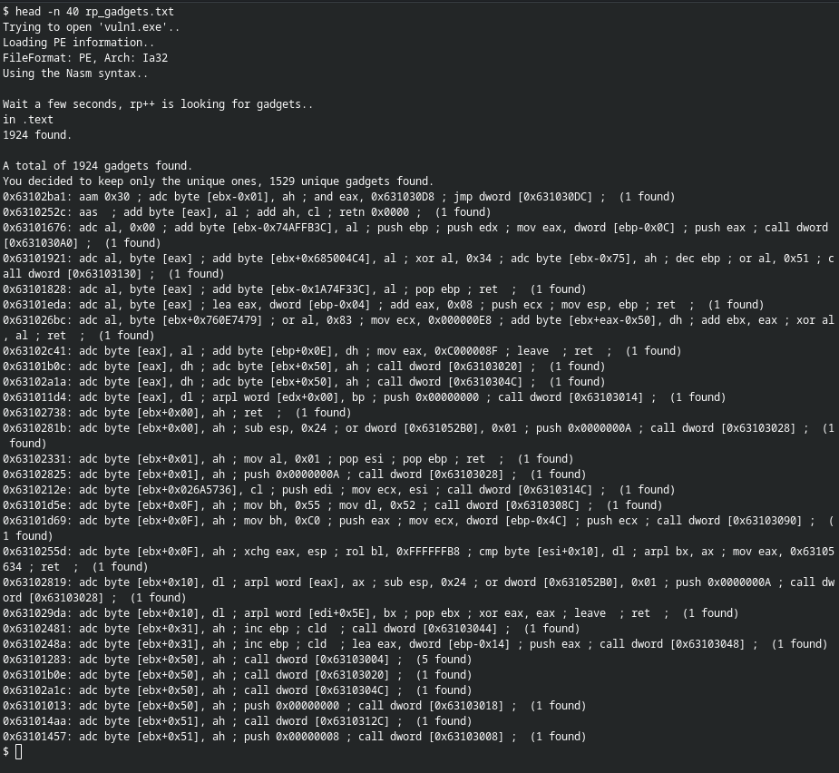
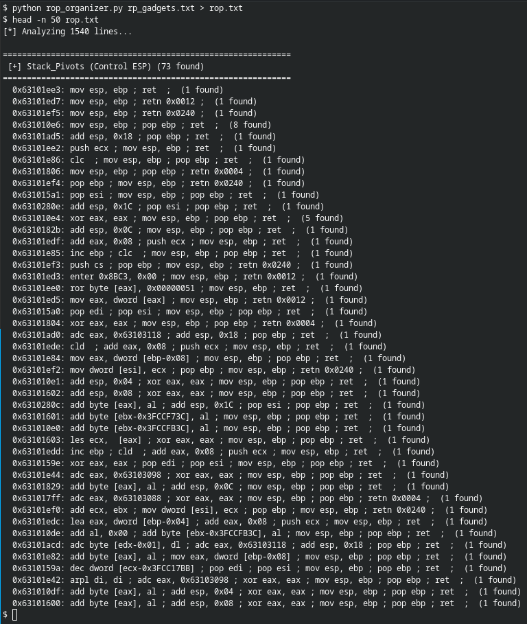

# rop_organizer
ROP Organizer is a lightweight Python tool that parses rp++ output and categorizes ROP gadgets for Windows x86 exploitation. It groups stack pivots, ESP transfers, dereference reads/writes, data movement, arithmetic, logic, and clean pop gadgets, with optional bad character filtering.


```bash
rp-win-x86.exe -f vuln1.exe -r 6 > rp_gadgets.txt
```





```bash
python rop_organizer.py rp_gadgets.txt > rop.txt
```


